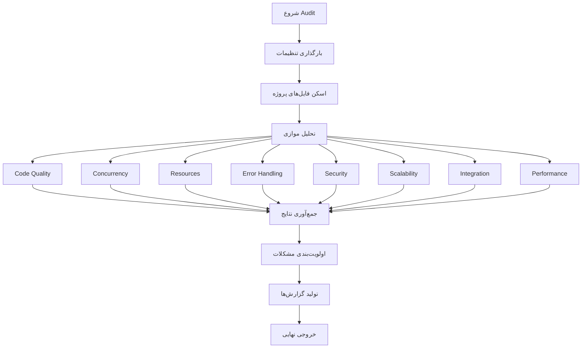

# Design Document - Production Readiness Audit

## Overview

این سند طراحی یک فرآیند جامع برای بررسی آمادگی ربات تلگرام برای تبلیغات گسترده و بار سنگین کاربران را ارائه می‌دهد. هدف شناسایی تمام نقاط ضعف، bottleneckها و مشکلات احتمالی قبل از راه‌اندازی کمپین تبلیغاتی است.

## Architecture

### 1. Audit Framework Structure

```
production-readiness-audit/
├── analyzers/
│   ├── code_quality_analyzer.py      # تحلیل کیفیت کد
│   ├── concurrency_analyzer.py       # تحلیل همزمانی
│   ├── resource_analyzer.py          # تحلیل منابع
│   ├── error_handling_analyzer.py    # تحلیل خطاها
│   ├── security_analyzer.py          # تحلیل امنیت
│   ├── scalability_analyzer.py       # تحلیل مقیاس‌پذیری
│   ├── integration_analyzer.py       # تحلیل یکپارچگی
│   └── performance_analyzer.py       # تحلیل عملکرد
├── reporters/
│   ├── markdown_reporter.py          # گزارش Markdown
│   ├── json_reporter.py              # گزارش JSON
│   └── html_reporter.py              # گزارش HTML
├── utils/
│   ├── ast_parser.py                 # پارس کد Python
│   ├── pattern_matcher.py            # تشخیص الگوها
│   └── metrics_calculator.py         # محاسبه معیارها
└── main_audit.py                     # نقطه ورود اصلی
```

### 2. Analysis Flow



## Components and Interfaces

### 1. Base Analyzer Interface

```python
class BaseAnalyzer(ABC):
    """کلاس پایه برای تمام تحلیلگرها"""
    
    @abstractmethod
    async def analyze(self, project_path: str) -> AnalysisResult:
        """تحلیل پروژه"""
        pass
    
    @abstractmethod
    def get_severity_level(self, finding: Finding) -> Severity:
        """تعیین سطح اهمیت"""
        pass
```

### 2. Code Quality Analyzer

**مسئولیت:** بررسی کیفیت کد، complexity، code smells

**تحلیل‌ها:**
- Cyclomatic Complexity (پیچیدگی توابع)
- Code Duplication (تکرار کد)
- Dead Code Detection (کد استفاده نشده)
- Import Analysis (وابستگی‌های غیرضروری)
- Naming Conventions (قراردادهای نام‌گذاری)
- Function Length (طول توابع)
- Class Cohesion (انسجام کلاس‌ها)

**الگوهای مشکل‌ساز:**
```python
# ❌ توابع بیش از حد طولانی (>100 خط)
# ❌ Nested loops عمیق (>3 سطح)
# ❌ Too many parameters (>5 پارامتر)
# ❌ Global variables مشکوک
# ❌ Magic numbers بدون توضیح
```

### 3. Concurrency Analyzer

**مسئولیت:** بررسی مشکلات همزمانی و race conditions

**تحلیل‌ها:**
- Shared Resource Access (دسترسی به منابع مشترک)
- Lock Analysis (استفاده صحیح از قفل‌ها)
- Deadlock Detection (احتمال deadlock)
- Thread Safety (ایمنی thread)
- Async/Await Patterns (الگوهای async)
- Semaphore Usage (استفاده از semaphore)
- Queue Management (مدیریت صف)

**نقاط بحرانی:**
```python
# بررسی موارد زیر:
- database.py: اتصالات همزمان به DB
- job_queue.py: مدیریت صف کارها
- concurrency.py: semaphore و locks
- youtube_handler.py: دانلودهای همزمان
- universal_downloader.py: API calls همزمان
```

**الگوهای خطرناک:**
```python
# ❌ دسترسی به shared state بدون lock
# ❌ استفاده از global variables در async
# ❌ Nested locks (احتمال deadlock)
# ❌ Race condition در file operations
# ❌ Missing await در async functions
```

### 4. Resource Analyzer

**مسئولیت:** بررسی مدیریت منابع (memory, files, connections)

**تحلیل‌ها:**
- File Handle Management (مدیریت فایل‌ها)
- Memory Leaks (نشت حافظه)
- Connection Pooling (استخر اتصالات)
- Temporary File Cleanup (پاک‌سازی فایل‌های موقت)
- Context Manager Usage (استفاده از with)
- Resource Limits (محدودیت منابع)

**بررسی‌های کلیدی:**
```python
# 1. File Operations
- آیا تمام open() ها با with استفاده می‌شوند؟
- آیا temporary files پاک می‌شوند؟
- آیا حجم فایل‌ها چک می‌شود؟

# 2. Database Connections
- آیا connection pool وجود دارد؟
- آیا connections به درستی بسته می‌شوند؟
- آیا timeout تنظیم شده؟

# 3. Memory Management
- آیا large files به صورت streaming پردازش می‌شوند؟
- آیا cache محدودیت دارد؟
- آیا garbage collection مشکلی ندارد؟
```

### 5. Error Handling Analyzer

**مسئولیت:** بررسی پوشش و کیفیت error handling

**تحلیل‌ها:**
- Exception Coverage (پوشش استثناها)
- Bare Except Detection (except بدون نوع)
- Error Logging (لاگ خطاها)
- Retry Mechanisms (مکانیزم تلاش مجدد)
- Timeout Handling (مدیریت timeout)
- Graceful Degradation (کاهش تدریجی سرویس)

**الگوهای بررسی:**
```python
# ✅ خوب
try:
    result = await api_call()
except SpecificError as e:
    logger.error(f"API failed: {e}")
    return fallback_value
except asyncio.TimeoutError:
    logger.warning("Timeout")
    raise
finally:
    cleanup()

# ❌ بد
try:
    result = await api_call()
except:  # Bare except
    pass  # Silent failure
```

**نقاط بحرانی:**
```python
- bot.py: مدیریت خطاهای اصلی
- youtube_handler.py: خطاهای yt-dlp
- universal_downloader.py: خطاهای API
- job_queue.py: خطاهای worker
- sqlite_db_wrapper.py: خطاهای database
```

### 6. Security Analyzer

**مسئولیت:** بررسی آسیب‌پذیری‌های امنیتی

**تحلیل‌ها:**
- Input Validation (اعتبارسنجی ورودی)
- SQL Injection (تزریق SQL)
- Path Traversal (دسترسی به مسیرهای غیرمجاز)
- Credential Exposure (افشای اطلاعات حساس)
- API Key Security (امنیت کلیدهای API)
- User Data Protection (حفاظت از داده‌های کاربر)

**بررسی‌های امنیتی:**
```python
# 1. Input Validation
- آیا URL ها sanitize می‌شوند؟
- آیا file paths validate می‌شوند؟
- آیا user input escape می‌شود؟

# 2. Credentials
- آیا API keys در .env هستند؟
- آیا passwords هش می‌شوند؟
- آیا tokens به درستی ذخیره می‌شوند؟

# 3. Database Security
- آیا از parameterized queries استفاده می‌شود؟
- آیا user permissions چک می‌شود؟
- آیا rate limiting وجود دارد؟
```

### 7. Scalability Analyzer

**مسئولیت:** بررسی محدودیت‌های مقیاس‌پذیری

**تحلیل‌ها:**
- Concurrent User Capacity (ظرفیت کاربران همزمان)
- Database Performance (عملکرد پایگاه داده)
- API Rate Limits (محدودیت‌های API)
- Memory Footprint (رد پای حافظه)
- CPU Usage Patterns (الگوهای استفاده CPU)
- Network Bandwidth (پهنای باند)

**محاسبات ظرفیت:**
```python
# فرمول‌های تخمین:

# 1. حداکثر کاربران همزمان
max_concurrent = (
    MAX_CONCURRENT_DOWNLOADS * 
    (average_download_time / average_user_wait_time)
)

# 2. حداکثر درخواست در ساعت
max_requests_per_hour = (
    MAX_CONCURRENT_DOWNLOADS * 
    (3600 / average_download_time)
)

# 3. حداکثر حجم دانلود روزانه
max_daily_bandwidth = (
    max_requests_per_hour * 24 * 
    average_file_size
)

# 4. نیاز حافظه
memory_needed = (
    MAX_CONCURRENT_DOWNLOADS * 
    average_file_size * 
    memory_multiplier
)
```

**Bottleneck Detection:**
```python
# شناسایی گلوگاه‌ها:
1. Database: تعداد queries در ثانیه
2. Network: پهنای باند آپلود/دانلود
3. CPU: پردازش ویدیو/صوتی
4. Memory: نگهداری فایل‌های بزرگ
5. Disk I/O: خواندن/نوشتن فایل‌ها
```

### 8. Integration Analyzer

**مسئولیت:** بررسی یکپارچگی با سرویس‌های خارجی

**تحلیل‌ها:**
- API Reliability (قابلیت اطمینان API)
- Fallback Mechanisms (مکانیزم‌های جایگزین)
- Circuit Breaker Patterns (الگوهای circuit breaker)
- Retry Strategies (استراتژی‌های تلاش مجدد)
- Timeout Configuration (تنظیمات timeout)
- Error Rate Monitoring (نظارت بر نرخ خطا)

**سرویس‌های بررسی:**
```python
# 1. YouTube (yt-dlp)
- Cookie management
- Proxy rotation
- Rate limiting
- Format selection

# 2. Instagram (RapidAPI)
- API quota
- Response time
- Error handling
- Fallback to OG tags

# 3. Spotify/TikTok/etc (RapidAPI)
- API availability
- Timeout handling
- Retry logic
- Circuit breaker

# 4. Telegram API
- FloodWait handling
- Upload optimization
- Message throttling
- Connection stability
```

## Data Models

### Finding Model

```python
@dataclass
class Finding:
    """یک یافته از تحلیل"""
    id: str
    category: str  # code_quality, concurrency, etc.
    severity: Severity  # CRITICAL, HIGH, MEDIUM, LOW
    title: str
    description: str
    location: Location  # file, line, function
    recommendation: str
    code_snippet: Optional[str]
    impact: str  # توضیح تأثیر
    effort: str  # تخمین زمان رفع: LOW, MEDIUM, HIGH
    tags: List[str]
```

### Severity Levels

```python
class Severity(Enum):
    CRITICAL = "critical"  # باید فوراً رفع شود
    HIGH = "high"          # باید قبل از production رفع شود
    MEDIUM = "medium"      # باید در اولویت بعدی رفع شود
    LOW = "low"            # می‌تواند بعداً رفع شود
    INFO = "info"          # اطلاعاتی
```

### Analysis Result

```python
@dataclass
class AnalysisResult:
    """نتیجه یک تحلیل"""
    analyzer_name: str
    findings: List[Finding]
    metrics: Dict[str, Any]
    execution_time: float
    timestamp: datetime
```

### Audit Report

```python
@dataclass
class AuditReport:
    """گزارش نهایی audit"""
    project_name: str
    audit_date: datetime
    results: List[AnalysisResult]
    summary: AuditSummary
    recommendations: List[Recommendation]
    action_plan: ActionPlan
```

## Error Handling

### Analyzer Error Handling

```python
class AnalyzerError(Exception):
    """خطای تحلیلگر"""
    pass

# هر analyzer باید خطاهای خود را handle کند
try:
    result = await analyzer.analyze(project_path)
except AnalyzerError as e:
    logger.error(f"Analyzer failed: {e}")
    # ادامه با سایر analyzerها
except Exception as e:
    logger.critical(f"Unexpected error: {e}")
    # ثبت و ادامه
```

### Graceful Degradation

```python
# اگر یک analyzer fail شد، بقیه ادامه می‌دهند
results = []
for analyzer in analyzers:
    try:
        result = await analyzer.analyze(project_path)
        results.append(result)
    except Exception as e:
        logger.error(f"{analyzer.name} failed: {e}")
        # ادامه با analyzer بعدی
```

## Testing Strategy

### 1. Unit Tests

```python
# تست هر analyzer به صورت جداگانه
def test_code_quality_analyzer():
    analyzer = CodeQualityAnalyzer()
    result = analyzer.analyze("test_project/")
    assert len(result.findings) > 0
    assert result.metrics['complexity'] < 10
```

### 2. Integration Tests

```python
# تست کل فرآیند audit
async def test_full_audit():
    audit = ProductionReadinessAudit()
    report = await audit.run("real_project/")
    assert report.summary.total_findings > 0
    assert report.action_plan is not None
```

### 3. Sample Projects

```python
# پروژه‌های نمونه با مشکلات شناخته شده
test_projects/
├── bad_concurrency/      # مشکلات همزمانی
├── memory_leaks/         # نشت حافظه
├── poor_error_handling/  # error handling ضعیف
└── security_issues/      # مشکلات امنیتی
```

## Performance Considerations

### 1. Parallel Analysis

```python
# اجرای موازی analyzerها
async def run_parallel_analysis(analyzers, project_path):
    tasks = [
        analyzer.analyze(project_path)
        for analyzer in analyzers
    ]
    results = await asyncio.gather(*tasks, return_exceptions=True)
    return [r for r in results if not isinstance(r, Exception)]
```

### 2. Caching

```python
# Cache کردن نتایج پارس AST
class ASTCache:
    def __init__(self):
        self.cache = {}
    
    def get_ast(self, file_path):
        if file_path not in self.cache:
            with open(file_path) as f:
                self.cache[file_path] = ast.parse(f.read())
        return self.cache[file_path]
```

### 3. Incremental Analysis

```python
# فقط فایل‌های تغییر یافته را تحلیل کن
def get_changed_files(since_commit):
    # استفاده از git diff
    result = subprocess.run(
        ['git', 'diff', '--name-only', since_commit],
        capture_output=True, text=True
    )
    return result.stdout.strip().split('\n')
```

## Output Formats

### 1. Markdown Report

```markdown
# Production Readiness Audit Report

## Executive Summary
- Total Findings: 45
- Critical: 3
- High: 12
- Medium: 20
- Low: 10

## Critical Issues
### 1. Race Condition in Database Access
**Location:** `plugins/sqlite_db_wrapper.py:145`
**Impact:** Data corruption under high load
**Recommendation:** Add proper locking mechanism
```

### 2. JSON Report

```json
{
  "audit_date": "2025-10-31T15:30:00",
  "project": "telegram-bot",
  "summary": {
    "total_findings": 45,
    "by_severity": {
      "critical": 3,
      "high": 12,
      "medium": 20,
      "low": 10
    }
  },
  "findings": [...]
}
```

### 3. HTML Dashboard

```html
<!-- Interactive dashboard با:
- نمودارها (charts)
- فیلترها (filters)
- جزئیات هر finding
- لینک به کد
-->
```

## Metrics and KPIs

### Code Quality Metrics

```python
metrics = {
    'total_lines': 15000,
    'code_lines': 12000,
    'comment_lines': 2000,
    'blank_lines': 1000,
    'average_complexity': 5.2,
    'max_complexity': 25,
    'duplication_percentage': 3.5,
    'test_coverage': 45.0
}
```

### Concurrency Metrics

```python
metrics = {
    'max_concurrent_operations': 32,
    'shared_resources': 5,
    'lock_usage': 12,
    'potential_deadlocks': 2,
    'race_conditions': 3
}
```

### Resource Metrics

```python
metrics = {
    'open_file_handles': 150,
    'unclosed_files': 5,
    'memory_leaks': 2,
    'temp_files_not_cleaned': 8,
    'connection_pool_size': 10
}
```

### Security Metrics

```python
metrics = {
    'sql_injection_risks': 0,
    'path_traversal_risks': 2,
    'exposed_credentials': 0,
    'unvalidated_inputs': 15,
    'missing_rate_limits': 3
}
```

## Prioritization Algorithm

```python
def calculate_priority_score(finding: Finding) -> float:
    """
    محاسبه امتیاز اولویت بر اساس:
    - Severity (40%)
    - Impact (30%)
    - Effort (20%)
    - Frequency (10%)
    """
    severity_weight = {
        Severity.CRITICAL: 10,
        Severity.HIGH: 7,
        Severity.MEDIUM: 4,
        Severity.LOW: 2
    }
    
    impact_weight = {
        'high': 10,
        'medium': 5,
        'low': 2
    }
    
    effort_weight = {
        'low': 10,    # کم تلاش = اولویت بالا
        'medium': 5,
        'high': 2
    }
    
    score = (
        severity_weight[finding.severity] * 0.4 +
        impact_weight[finding.impact] * 0.3 +
        effort_weight[finding.effort] * 0.2 +
        finding.frequency * 0.1
    )
    
    return score
```

## Action Plan Generation

```python
def generate_action_plan(findings: List[Finding]) -> ActionPlan:
    """
    تولید برنامه اقدام اولویت‌بندی شده
    """
    # گروه‌بندی بر اساس اولویت
    critical = [f for f in findings if f.severity == Severity.CRITICAL]
    high = [f for f in findings if f.severity == Severity.HIGH]
    
    # Quick wins (high impact, low effort)
    quick_wins = [
        f for f in findings 
        if f.impact == 'high' and f.effort == 'low'
    ]
    
    return ActionPlan(
        immediate_actions=critical,
        short_term=high + quick_wins,
        medium_term=[...],
        long_term=[...]
    )
```

## Integration with CI/CD

```yaml
# .github/workflows/audit.yml
name: Production Readiness Audit

on:
  push:
    branches: [main, develop]
  pull_request:
  schedule:
    - cron: '0 0 * * 0'  # هر هفته

jobs:
  audit:
    runs-on: ubuntu-latest
    steps:
      - uses: actions/checkout@v2
      - name: Run Audit
        run: python audit/main_audit.py
      - name: Upload Report
        uses: actions/upload-artifact@v2
        with:
          name: audit-report
          path: audit_report.html
```

## Monitoring and Alerts

```python
# تنظیم آلارم برای مشکلات critical
if critical_findings:
    send_alert_to_admin(
        title="Critical Issues Found",
        findings=critical_findings,
        urgency="high"
    )

# گزارش هفتگی
if is_weekly_report_day():
    send_weekly_summary(
        total_findings=len(findings),
        trends=calculate_trends(),
        recommendations=top_recommendations
    )
```

## Continuous Improvement

```python
# ذخیره تاریخچه برای tracking پیشرفت
def save_audit_history(report: AuditReport):
    history_file = f"audit_history/{report.audit_date}.json"
    with open(history_file, 'w') as f:
        json.dump(report.to_dict(), f)

# مقایسه با audit قبلی
def compare_with_previous(current, previous):
    improvements = []
    regressions = []
    
    for category in categories:
        current_count = current.count_by_category(category)
        previous_count = previous.count_by_category(category)
        
        if current_count < previous_count:
            improvements.append(category)
        elif current_count > previous_count:
            regressions.append(category)
    
    return improvements, regressions
```

## Conclusion

این طراحی یک سیستم جامع برای بررسی آمادگی production ارائه می‌دهد که:

1. **جامع**: تمام جنبه‌های مهم را پوشش می‌دهد
2. **خودکار**: بدون نیاز به دخالت دستی اجرا می‌شود
3. **قابل توسعه**: می‌توان analyzerهای جدید اضافه کرد
4. **عملی**: نتایج قابل اجرا و اولویت‌بندی شده
5. **پیوسته**: می‌تواند در CI/CD یکپارچه شود

با اجرای این audit، می‌توانیم با اطمینان بیشتری ربات را برای تبلیغات گسترده آماده کنیم.
